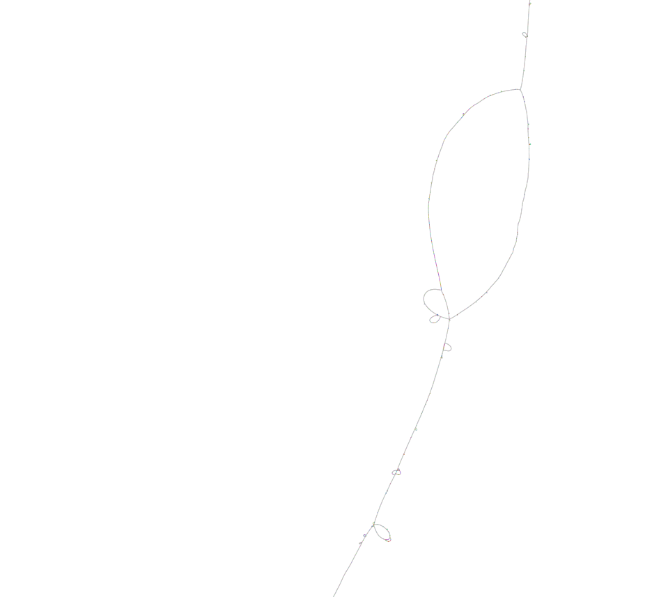
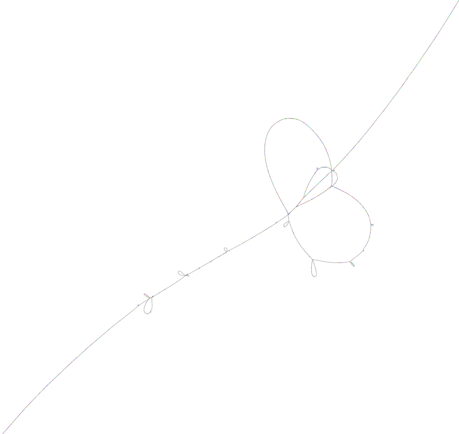

# The Minigraph-Cactus Pangenome Pipeline

Minigraph-Cactus is included in the [Cactus Software Package](../README.md) and is suitable for aligning similar samples, such as those from the *same species*. See [Progressive Cactus](./progressive.md) for aligning different species. 

Please cite the [Minigraph-Cactus paper](https://doi.org/10.1038/s41587-023-01793-w) when using Minigraph-Cactus.

## Table of Contents

* [Pangenome Data](#pangenome-data)
* [Quick-Start](#quick-start)
* [Introduction](#introduction)
* [Interface](#interface)
* [Output](#output)
* [Yeast Graph](#yeast-graph)
* [MHC Graph](#mhc-graph)
* [GRCh38 Alts Graph](#grch38-alts-graph)
* [Human Graph](#hprc-graph)
* [Frequently Asked Questions](#frequently-asked-questions)

## Pangenome Data

Some pangenomes constructed with Minigraph-Cactus, along with all material to reproduce, can be found [here](./mc-pangenomes/README.md). 

## Quick-Start

The Mingraph-Cactus pipeline is run with `cactus-pangenome`. Its input is a text file with two columns, separated by whitespace, denoting sample name and fasta URL, respectively. All output is written to a directory specified with `--outDir`. All output filenames are prefixed with the value of `--outName`.

Begin by making a pangenome for tiny simulated primates:

```
cactus-pangenome ./js ./examples/evolverPrimates.txt --outDir primates-pg --outName primates-pg --reference simChimp --vcf --giraffe --gfa --gbz
```

If it worked properly, the input sequences should show up as contigs in the GFA:
```
zcat primates-pg/primates-pg.gfa.gz | grep '^W' | awk '{print $1 "\t" $2 "\t" $3 "\t" $4 "\t" $5 "\t" $6 }' | more
W	simChimp	0	simChimp.chr6	0	596350
W	simGorilla	0	simGorilla.chr6	0	599081
W	simHuman	0	simHuman.chr6	0	597871
W	simOrang	0	simOrang.chr6	0	591073
```

The reference path, which will be treated differently by some vg tools (for efficiency), will be identified in the header:
```
zcat primates-pg/primates-pg.gfa.gz | head -1
H	VN:Z:1.1	RS:Z:simChimp
```

The VCF will be based on the reference path (simChimp) and have a sample for each haplotype :
```
gzip -dc primates-pg/primates-pg.vcf.gz | grep CHROM -A 1
#CHROM	POS	ID	REF	ALT	QUAL	FILTER	INFO	FORMAT	simGorilla	simHuman	simOrang
simChimp.chr6	15	>1>4	T	G	60.0	.	AC=1;AF=0.333333;AN=3;AT=>1>2>4,>1>3>4;NS=3;LV=0	GT	0	0	1
```

The three input files needed for giraffe are produced:
```
ls -hs primates-pg/primates-pg.d2.*
4.8M primates-pg/primates-pg.d2.dist  2.5M primates-pg/primates-pg.d2.gbz  6.1M primates-pg/primates-pg.d2.min
```

By default, `--giraffe` will produce frequency filtered indexes, with a default minimum coverage of 2 (hence the `.d2`). This means only nodes covered by two haplotypes will appear in the index. This helps `vg giraffe` performance considerably (though a version of Giraffe that no longer needs it is under development). The dataset here is too small for this to be useful.  To index the clipped but unfiltered graph, use `--giraffe clip` or use `--giraffe full` to index the full, unclipped graph. See more detailed explanations below. 


## Introduction

Minigraph-Cactus uses [minigraph](https://github.com/lh3/minigraph) to construct a pangenome graph of structural variation in a set of input assemblies. The assemblies are then mapped back to this graph using minigraph.  These mappings are used as input to [Cactus](../README.md) to construct a new graph that contains variants of all sizes, allowing the input assemblies to be encoded as embedded paths in the graph. The graph is output in  pangenome graph formats such as [vg](https://github.com/vgteam/vg) and [GFA](https://github.com/GFA-spec/GFA-spec), in addition to the usual [HAL](https://github.com/ComparativeGenomicsToolkit/hal).

Pangenomes from Minigraph-Cactus are indexable for and ready for read mapping with [vg Giraffe](https://github.com/vgteam/vg/wiki/Mapping-short-reads-with-Giraffe). 

Unlike Progressive Cactus, Minigraph-Cactus does depend on a predetermined reference genome.  This genome is guaranteed to be acyclic and unclipped in the final graph.  Other genomes in the graph can still be used as reference coordinate systems, however.  For example, we achieved great variant calling performance when projecting mapped reads on a CHM13-referenced graph onto GRCh38. 

## Interface

To run the Minigraph-Cactus pangenome pipeline, the basic format is:

```
cactus-pangenome <jobStorePath> <seqFile> --outDir <output directory> --outName <output file prefix> --reference <reference sample name>
```

The `jobStorePath` is where intermediate files, as well as job metadata, [will be kept by Toil](https://toil.readthedocs.io/en/latest/running/introduction.html#job-store). **It must be accessible to all worker systems.** 


The `seqFile` is a two-column  mapping sample names to fasta paths (gzipped fastas are supported). The seqfile is the same as Progressive Cactus, except a tree is not specified.

### Sample Names

**A naming convention must be followed for sample names where "." characters have special meaning**: The "." character is used to specify haplotype, and should be avoided in sample names unless it is being used that way.  For haploid samples, just don't use a "`.`".  For diploid or polyploid samples, use the form `SAMPLE.HAPLOTYPE` where `HAPLOTYPE` is `1` or `2` for a diploid sample etc:

```
# Diploid sample:
HG002.1  ./HG002.paternal.fa
HG002.2  ./HG002.maternal.fa

# Haploid sample:
CHM13  ./chm13.fa
```

### Reference Sample

The `--reference` option must be used to select a "reference" sample.  This sample will:
* Never be clipped.
* Never be self-aligned ie its path in the output graph will be acyclic
* Only visit nodes in their forward orientations
* Be a "reference-sense" path in vg/gbz and will therefore be indexably for fast coordinate lookup
* Be the basis for the output VCF and therefore won't appear as a sample in the VCF
* Be used to divide the graph into chromosomes

It is therefore extremely important that the reference sample's assembly be **chromosome** scale.  If there are many small contigs in the addition to chromosomes in the reference assembly, then please consider specifying the chromosomes with `--refContigs`. If you still want to keep the other contigs, add `--otherContig chrOther` (see explanation below).

#### Multiple Reference Samples

The `--reference` option can accept multiple samples (separated by space). If multiple samples are specified beyond the first, they will be clipped as usual, but end up as "reference-sense" paths in the vg/gbz output.  They can also be used as basis for VCF, and VCF files can be created based on them with the `--vcfReference` sample.

For example, for human data one might consider using `--reference CHM13 GRCh38 GRCh37 --vcfReference CHM13 GRC3h8`.  This will make a graph referenced on CHM13, but will promote GRCh38 and GRCh38 to reference-sense paths so that they could be used, for example, to project BAMs on in `vg giraffe`.  Two VCFs will be output, one based on CHM13 and one based on GRCh38. 

### Pipeline

The Minigraph-Cactus pipeline is run via the `cactus-pangenome` command. It consists of five stages which can also be run individually (below). `cactus-pangenome` writes output files into `--outDir` at the end of each stage. So different stages can be rerun with if necessary using the lower-level commands.

**Before running large jobs, it is important to consider the following options:**

* `--mgCores` the number of cores for `minigraph` construction (default: all available)
* `--mapCores` the number of cores for each `minigraph` mapping job (default: up to 6)
* `--consCores` the number of cores for each `cactus-consolidated` job (default: all available)
* `--indexCores` the number of cores for each `vg` indexing job (default: all available - 1)
* The various output options: `--gbz`, `--gfa`, `--giraffe`, `--vcf` which are explained in detail below. If you forget to add one of these and are missing the corresponding output, you will need to rerun `cactus-graphmap-join` (or use `vg` to manually make the file yourself).

Reducing `--consCores` will allow more chromosomes to be aligned at once, requiring more memory. VCF export for very large graphs will take a long time unless `--indexCores` is set high, but `--indexCores` should still be at least 1 lower than all cores available to allow some parallelism. 

**PLEASE NOTE** While many Minigraph-Cactus parameters' default values were tuned on high-quality human assemblies from the HPRC where ample benchmarking data was available, we believe they will be suitable for other datasets and species, so long as the contigs can be mapped with [minigraph](https://github.com/lh3/minigraph). By default, [small contigs are filtered out](https://github.com/ComparativeGenomicsToolkit/cactus/blob/v2.4.4/src/cactus/cactus_progressive_config.xml#L319-L335) during chromosome assignment using more stringent thresholds. This might lead to a surprisingly low sensitivity on small, fragmented, diverse assemblies or difficult-to-assemble regions. Users wishing to *keep* these contigs in their graph can use the following option:

* `--permissiveContigFilter`

The application and impact of this option is demonstrated in the explanation of the Yeast pangenome example below.

**Important** The reference genome assembly must be chromosome scale. If your reference assembly also consists of many small fragments (ex GRCh38) then you can use the `--refContigs` option to specify the chromosomes.  Ex for GRCh38 `--refContigs $(for i in `seq 22`; do printf "chr$i "; done ; echo "chrX chrY chrM")`.  If you want to include the remaining reference contig fragments in your graph, add the `--otherContig chrOther` option.  If you do not specify `--refContigs`, they will be determined automatically and small contigs will be included. 

**Also Important** We do not yet automatically support the *alternate* loci from GRCh38, ex the various HLA contigs.  They must be excluded from the input fasta file to get sane results. They can be included in the graph by providing a separate sample / fasta pair in the input for each contig.  Please [here](#grch38-alts-graph) for an example of how to do so.

The individual parts of the pipeline can be run independently using the following commands.  See also the "step-by-step" yeast example below. 

1) `cactus-minigraph <jobStore> <seqFile> <outputGFA> --reference`: Construct a minigraph in GFA format (may be gzipped) from a set of FASTA files (may also be gzipped).  This is a very thin wrapper over `minigraph -cxggs`.  The reference is added first and the remainder of samples are added in decreasing order of decreasing mash distance to the reference (see the `minigraphSortInput` parameter in the XML config to change or disable this).  Use the `--mapCores` option to specify the number of cores.

2) `cactus-graphmap <jobStore> <seqFile> <inputGFA> <outputPAF> --reference`: Map each input assembly back to the graph using `minigraph`.  The number of cores for each mapping job can be set with `--mapCores`.  

3) **(Optional)** `cactus-graphmap-split <jobStore> <seqFile> <inputGFA> <inputPAF> --reference --outDir`: Split the input assemblies and PAF into chromosomes using the rGFA tags in the GFA. Doing so reduces the memory requirements in the following steps.  It assigns each contig to a single chromosome according to the alignment in the input PAF, so all inter-chromosomal events will be filtered out.  Contigs that can't be assigned to a chromosome are deemed "ambiguous" and not considered in later steps.

4) `cactus-align <jobStore> <seqFile> <inputPAF> <outHal> --reference --pangenome --outVG --maxLen`: Compute the Cactus multiple genome alignment from the assembly-to-graph minigraph mappings. The `--maxLen` parameter specifies the maximum gap between minigraph mappings that Cactus will attempt to fill at once, and is recommended to be set to 10000.  If `cactus-graphmap-split` was used, the `cactus-align` `--batch` interface should be used instead (on the chromfile.txt output rather than seqfile.txt) (see examples below).

5) `cactus-graphmap-join <jobStore>  --vg --outDir --outName --reference`: Produce the final graph and indexes. This should be run whether or not `cactus-graphmap-split` was used.

### Clipping, Filtering and Indexing

`cactus-pangenome` (options also available in `cactus-graphmap-join`) normalizes, clips and filters the graph in addition to producing some useful indexes.  It can produce up to three graphs (now in a single invocation), and a variety of indexes for any combination of them. The three graphs are the

* `full` graph: This graph is normalized, but no sequence is removed. It and its indexes will have `.full` in their filenames. 
* `clip` graph: This is the default graph. Stretches of sequence `>10kb` that were not aligned to the underlying SV/minigraph are removed. "Dangling" nodes (ie that don't have an edge on each side) that aren't on the reference path are also removed, so that each chromosome only has two tips in the graph.
* `filter` graph: This graph is made by removing nodes covered by fewer than 2 haplotypes from the `clip` graph.  It and its indexes will have `.d2` in their filenames.

The `clip` graph is a subgraph of the `full` graph and the `filter` graph is a subgraph of the `clip` graph. Put another way, any node in the `filter` graph exists with the exact same ID and sequence in the `clip` graph, etc. 

The different graphs have different uses. For instance, the current version of `vg giraffe` performs best on the filtered graph (this will hopefully be soon remedied in an update to vg).  For the HPRC v1.0 graph and paper, we used `d9`. When you use `--giraffe`, it will make the giraffe indexes on the filtered graph by default.  But you can override this behaviour to produces the indexes for any of the graphs by passing in any combination of [`full`, `clip` and `filter`] to the `--giraffe` options. For example:

`--giraffe`: Make the giraffe indexes for the filtered graph (default choice).

`--giraffe clip`: Make the giraffe indexes for the clipped graph.

`--giraffe clip filter`: Make the giraffe indexes for both the clipped and filtered graph.

The same type of interface applies to all the output specification options: `--vcf`, `--gbz`, `--gfa`, `--giraffe`, `--chrom-vg`. They can all be used without arguments to apply to the default graph (generally the `clip` graph for everything except `--giraffe` which defaults to the `filter` graph), or with any combination of `full`, `clip` and `filter` to be applied to different graphs.

Note that by default, only GFA is output, so the above options need to be used to toggle on any other output types. 

Different clipping and filtering thresholds can be specified using the `--clip` and `--filter` options, respectively. For larger graphs, you probably want to use `--filter N` where `N` represents about 10% of the haplotypes.  It is indeed a shame to remove rarer variants before mapping, but is a necessity to get the best performance out of (the current version) of `vg giraffe`.  

The `--vcf` option will produce two VCFs for each selected graph type. One VCF is a "raw" VCF which contains nested variants, indicated by the `LV` and `PS` tags. The second VCF is one that has gone through [vcfbub](https://github.com/pangenome/vcfbub) to remove nested sites, as well as those greater than 100kb.  Unless you want to explicitly handle nested variants, you are probably best to use the `vcfbub` VCF.  Switch off `vcfbub` with `--vcfbub 0` or specify a different threshold with `--vcfbub N`.

### Output

* `hal`: Cactus's [native alignment format](./progressive.md#using-the-hal-output) can be used to convert to MAF, build assembly hubs, run liftover and comparative annotation.
* `gfa`: A [standard text-based graph format](https://github.com/GFA-spec/GFA-spec/blob/master/GFA1.md). Minigraph-Cactus uses GFA 1.1 as it represents haplotypes as [Walks](https://github.com/GFA-spec/GFA-spec/blob/master/GFA1.md#w-walk-line-since-v11). You can use `vg convert -gfW` to convert from GFA 1.1 to 1.0 and `vg convert -gf` to convert from 1.0 to 1.1.
* `vcf`: A [standard text-based format](https://en.wikipedia.org/wiki/Variant_Call_Format) that represents a pangenome graph as sites of variation along a reference. VCFs exported from the graph are nested, and by default `vcfbub` is used to flatten them.
* `vg`: [vg](https://github.com/vgteam/vg)'s native packed-graph format, can be read and written by vg but does not scale well with the number of paths.
* `gbz`: A read-only [format that scales extremely efficiently with the number of paths](https://github.com/jltsiren/gbwtgraph/blob/master/SERIALIZATION.md). Readable by `vg` tools and required for `giraffe`.  
* `snarls`: The start and end nodes of the bubbles in the graph, as well as their nesting relationships.  Used by some `vg` tools like `call` and `deconstruct`.
* `dist`: Snarl distance index required for `vg giraffe`.
* `min`: Minimizer index required for `vg giraffe`.
* `stats.tgz`: Some stats about how much sequence was clipped, including a BED file of the removed sequence.

#### Node Chopping

The GBZ format uses 10 bits to store offsets within nodes, which imposees a 1024bp node length limit. Nodes are therefore chopped up as requried in the `.gbz` output (described above) to respect this limit. The index files derived from the `.gbz`: `.snarls`, `.dist`, and `.min` will share the `.gbz` graph's chopped ID space. 

The `.gfa.gz` and node IDs referred to in the `.vcf.gz` file (via the variant IDs, AT and PS tags) are not chopped and therefore inconsistent with the `.gbz`.  This can be very confusing when trying to, for example, locate a variant in the `vcf.gz` back in the `.gbz` using node IDs: Node `X` in `.vcf.gz` and node `X` in `.gbz` will often both exist but can be totally different parts of the graph. 

If you would rather have a VCF with consistent IDs to the GBZ as opposed to GFA, you can toggle this via the config XML
```
sed src/cactus/cactus_progressive_config.xml -e "s/GFANodeIDsInVCF=\"1\"/GFANodeIDsInVCF=\"0\"/g" > config.xml
```
then pass `--configFile config.xml` to `cactus-graphmap-join`

If you want to see the mapping between the unchopped (2nd column) and chopped (3rd column) nodes, you can do so with
```
vg gbwt -Z  graph.gbz --translation mapping.tsv
```

If you want to make a GFA file with chopped nodes to be exactly equivalent to the GBZ
```
vg convert -f graph.gbz --vg-algorithm > graph.gfa
```

If you are running `vg call` or `vg deconstruct` on the GBZ yourself, the output VCF will, by default, use the chopped IDs from the GBZ. You can switch to the unchopped IDs using `-O` for both tools. 

## Yeast Graph

This is a small test case whose input data is included in cactus that illustrates how to split by chromosome. 

```
cactus-pangenome ./js ./examples/yeastPangenome.txt --reference S288C --outDir yeast-pg --outName yeast-pg --vcf --giraffe
```

All the output will be written to `./yeast-pg` as it is computed and is described below in the context of the equivalent lower-level commands that could be used to compute the same pangenome.

### Yeast: Getting Started

Below is an example of creating a yeast pangenome chromosome by chromosome, referenced on S288C.  

```
# make the seqfile
mkdir -p yeast-pg
cp ./examples/yeastPangenome.txt yeast-pg/

# make the minigraph
cactus-minigraph ./jobstore  ./yeast-pg/yeastPangenome.txt ./yeast-pg/yeast.sv.gfa  --reference S288C

# map back to the minigraph
cactus-graphmap ./jobstore ./yeast-pg/yeastPangenome.txt ./yeast-pg/yeast.sv.gfa ./yeast-pg/yeast.paf \
--outputFasta ./yeast-pg/yeast.sv.gfa.fa  --reference S288C
```

### Yeast: Splitting By Chromosome
Now the PAF and GFA `minigraph` output can be used to partition the graph and mappings based on the reference genome's (S288C's) chromosomes:

```
cactus-graphmap-split ./jobstore ./yeast-pg/yeastPangenome.txt ./yeast-pg/yeast.sv.gfa \
./yeast-pg/yeast.paf --outDir yeast-pg/chroms  --reference S288C
```

This command makes a cactus subproblem for each reference chromosome.  By default, it uses all contigs in the reference.  A subset can be specified using the `--refContigs` option.

In this example, for instance, the `chrI` data can be found as follows.  This is everything required to run `cactus-align` on it as described previously.

```
ls -hs yeast-pg/chroms/chrI/* yeast-pg/chroms/seqfiles/chrI.seqfile 
264K yeast-pg/chroms/chrI/chrI.gfa   44K yeast-pg/chroms/chrI/chrI.paf  4.0K yeast-pg/chroms/seqfiles/chrI.seqfile

yeast-pg/chroms/chrI/fasta:
total 656K
 68K DBVPG6044.0_chrI.fa.gz   68K S288C_chrI.fa.gz   68K UWOPS034614.0_chrI.fa.gz   72K YPS128.0_chrI.fa.gz
244K _MINIGRAPH__chrI.fa      72K SK1.0_chrI.fa.gz   64K Y12.0_chrI.fa.gz
```

Some contigs cannot be assigned to a reference chromosome.  These end up in the `_AMBIGUOUS_` directory:
```
ls -hs yeast-pg/chroms/_AMBIGUOUS_/*
188K yeast-pg/chroms/_AMBIGUOUS_/_AMBIGUOUS_.paf

yeast-pg/chroms/_AMBIGUOUS_/fasta:
total 1.2M
   0 DBVPG6044.0__AMBIGUOUS_.fa.gz     0 S288C__AMBIGUOUS_.fa.gz  1.2M UWOPS034614.0__AMBIGUOUS_.fa.gz     0 YPS128.0__AMBIGUOUS_.fa.gz
   0 _MINIGRAPH___AMBIGUOUS_.fa        0 SK1.0__AMBIGUOUS_.fa.gz     0 Y12.0__AMBIGUOUS_.fa.gz
```

Here we can see that a few contigs from UWOPS034614 were left unplaced (and would be left out of any future cactus jobs).

```
zcat yeast-pg/chroms/_AMBIGUOUS_/fasta/UWOPS034614__AMBIGUOUS_.fa.gz | grep '>'
>id=UWOPS034614|chrXI
>id=UWOPS034614|chrX
>id=UWOPS034614|chrVII
>id=UWOPS034614|chrVIII
```

The reason why these contigs are unassigned to a chromosome can normally be found in `minigraph.split.log`:

```
Query contig is ambiguous: id=UWOPS034614|chrXI  len=792116 cov=0.573045 (vs 0.5) uf=1.47861 (vs 2)
 Reference contig mappings:
  chrVII: 306989
  chrXI: 453918
--
Query contig is ambiguous: id=UWOPS034614|chrVIII  len=738767 cov=0.481758 (vs 0.5) uf=1.06071 (vs 2)
 Reference contig mappings:
  chrVII: 355907
  chrVIII: 335536
--
Query contig is ambiguous: id=UWOPS034614|chrVII  len=632616 cov=0.407576 (vs 0.5) uf= infinity (vs 2)
Assigned contig to chrXI: id=DBVPG6044|chrXI  len=695907 cov=0.972054 (vs 0.5) uf= infinity (vs 2)
Query contig is ambiguous: id=UWOPS034614|chrX  len=1092164 cov=0.49082 (vs 0.25) uf=1.04957 (vs 2)
 Reference contig mappings:
  chrX: 510741
  chrXIII: 536056

```
This log shows that these contigs were omitted because they could not be confidently mapped (presumably due to an inter-chromosomal event) to a single reference chromosome. These filters can be turned down with the `--permissiveContigFilter` option (other either `cactus-graphmap-split` or `cactus-pangenome`).  Using that here will assign all UWOPS034614 contigs to the reference chromosome they best align to. For example, `UWOPS034614|chrXI` would end up in the graph for `chrXI` and the approximately 40% of the contig that better aligns to `chrVII` would most likely end up unaligned and removed in postprocessing. The exact thresholds are explained, and can be adjusted in, the `<graphmap-split>` section of the [cactus config](../src/cactus/cactus_progressive_config.xml).


### Yeast: Batch Aligning the Chromosomes

`cactus-align` can be run individually on each chromosome using the seqFiles created above by way of the `--batch` option.  When this is used, the input is expected to be the "chromfile" created by `cactus-graphmap-split` rather than the usual seqfile. Also, its output parameter is interpreted as an output directory, rather than an output HAL file. 

```
cactus-align ./jobstore ./yeast-pg/chroms/chromfile.txt yeast-pg/chrom-alignments \
--batch --pangenome --reference S288C --outVG 
```

The results are a HAL and VG file for each chromosome:
```
ls -hs yeast-pg/chrom-alignments/
total 72M
920K chrI.hal    2.1M chrII.vg   1.6M chrIX.hal  3.1M chrVII.hal   1.2M chrVI.vg   3.5M chrXII.hal   1.4M chrXI.vg    3.6M chrXV.hal
2.7M chrII.hal   1.3M chrI.vg    1.7M chrIX.vg   1.6M chrVIII.hal  1.6M chrV.vg    2.9M chrXIII.hal  2.7M chrXIV.hal  3.2M chrXVI.hal
1.3M chrIII.hal  5.1M chrIV.hal  2.0M chrV.hal   1.3M chrVIII.vg   2.1M chrX.hal   2.2M chrXIII.vg   2.4M chrXIV.vg   2.5M chrXVI.vg
1.3M chrIII.vg   4.4M chrIV.vg   1.1M chrVI.hal  2.4M chrVII.vg    2.0M chrXI.hal  3.1M chrXII.vg    1.7M chrX.vg     3.1M chrXV.vg
```

### Yeast: Joining the Chromosome Alignments

As in the primates example, `cactus-graphmap-join` is used to make the final indexes.  Its use is identical, except multiple graphs are passed as input.  We also pass in the HAL files so it can merge them too.

```
cactus-graphmap-join ./jobstore --vg yeast-pg/chrom-alignments/*.vg --hal yeast-pg/chrom-alignments/*.hal \
--outDir ./yeast-pg --outName yeast-pg --reference S288C --vcf --giraffe clip

```

The GFA, VCF and all `vg giraffe` indexes will now be in `yeast-pg`:
```
ls -hs yeast-pg/yeast-pg*
 21M yeast-pg/yeast-pg.dist      103M yeast-pg/yeast-pg.min             4.3M yeast-pg/yeast-pg.vcf.gz
 38M yeast-pg/yeast-pg.full.hal  4.6M yeast-pg/yeast-pg.raw.vcf.gz      8.0K yeast-pg/yeast-pg.vcf.gz.tbi
 16M yeast-pg/yeast-pg.gbz       8.0K yeast-pg/yeast-pg.raw.vcf.gz.tbi
 14M yeast-pg/yeast-pg.gfa.gz     16K yeast-pg/yeast-pg.stats.tgz

zcat yeast-pg/yeast-pg.gfa.gz | grep '^W' | awk '{print $1 "\t" $2 "\t" $3 "\t" $4 "\t" $5 "\t" $6 }' | grep S288C
W	S288C	0	chrIII	0	341580
W	S288C	0	chrII	0	813597
W	S288C	0	chrI	0	219929
W	S288C	0	chrIV	0	1566853
W	S288C	0	chrIX	0	440036
W	S288C	0	chrVIII	0	581049
W	S288C	0	chrVII	0	1091538
W	S288C	0	chrVI	0	271539
W	S288C	0	chrV	0	583092
W	S288C	0	chrXIII	0	930506
W	S288C	0	chrXII	0	1075542
W	S288C	0	chrXI	0	666862
W	S288C	0	chrXIV	0	777615
W	S288C	0	chrX	0	751611
W	S288C	0	chrXVI	0	954457
W	S288C	0	chrXV	0	1091343

halStats yeast-pg/yeast-pg.full.hal --sequenceStats S288C
SequenceName, Length, NumTopSegments, NumBottomSegments
chrI, 219929, 5766, 0
chrII, 813597, 15896, 0
chrIII, 341580, 7778, 0
chrIV, 1566853, 32488, 0
chrIX, 440036, 10368, 0
chrV, 583092, 12226, 0
chrVI, 271539, 6587, 0
chrVII, 1091538, 19912, 0
chrVIII, 581049, 9996, 0
chrX, 751611, 12635, 0
chrXI, 666862, 11861, 0
chrXII, 1075542, 21991, 0
chrXIII, 930506, 16183, 0
chrXIV, 777615, 17052, 0
chrXV, 1091343, 23011, 0
chrXVI, 954457, 19805, 0
```

### Yeast: Making a UCSC Genome Browser Assembly Hub

The HAL file can be used to produce an assembly hub has follows.  Note that `PYTHONPATH` must set as described in Cactus's installation instructions. 

```
hal2assemblyHub.py ./jobstore ./yeast-pg/yeast-pg.full.hal yeast-pg/hub --shortLabel yeast --longLabel "yeast pangenome"
```

Move `yeast-pg/hub` to somewhere web-accessible, and pass the full URL of `yeast-pg/hub/hub.txt` to the Genome Browser in the "My Data -> Track Hubs" menu.   Select `S288C` as the reference and display the hub.  Right-click on the display and select "Configure yeast track set" to toggle on all the assemblies (and toggle off Anc0 and _MINIGRAPH_).

## MHC Graph

This is an example of how to build a [MHC](https://en.wikipedia.org/wiki/Major_histocompatibility_complex) Pangenome using [Minigraph example data of 61 haplotypes from the HPRC year 1 release](https://zenodo.org/record/6617246#.ZC0OQ-xBxhE). The first step is to convert the [AGC](https://github.com/refresh-bio/agc) archive into a seqfile:
```
# download the agc binary (if you don't already have it)
wget -q https://github.com/refresh-bio/agc/releases/download/v3.0/agc-3.0_x64-linux-noavx.tar.gz
tar zxf agc-3.0_x64-linux-noavx.tar.gz
export PATH=$(pwd)/agc-3.0_x64-linux-noavx/:${PATH}

# download the sequences
wget -q https://zenodo.org/record/6617246/files/MHC-61.agc

# make the seqfile
mkdir -p mhc-fa ; rm -f mhc-seqfile.txt
for s in $(agc listset MHC-61.agc); do printf "${s}\tmhc-fa/${s}.fa\n" >> mhc-seqfile.txt; agc getset MHC-61.agc $s > mhc-fa/${s}.fa; done

# (Optional) clean up the sample names. if you don't do this, adjust --reference accordingly below
sed -i mhc-seqfile.txt -e 's/^MHC-00GRCh38/MHC-GRCh38/g' -e 's/^MHC-CHM13.0/MHC-CHM13/g'

# (Optional) clean up the contig names (replacing numbers with "MHC")
for f in mhc-fa/*.fa; do sed -i ${f} -e 's/#0/#MHC/g' -e 's/#1/#MHC/g' -e 's/#2/#MCH/g'; done
```

The indexed pangenome can now be constructed as follows.  You can set the reference to `MHC-CHM13` instead of `MHC-GRCh38`. `--mapCores 1` is used to increase parallelism. The pipeline should take about 15 minutes on a system with 8 cores. 
```
cactus-pangenome ./js ./mhc-seqfile.txt --outDir mhc-pg --outName mhc --reference MHC-GRCh38 --gbz --giraffe --vcf --mapCores 1
```

## GRCh38 Alts Graph

It's not often utilized as such, but the GRCh38 reference genome is actually a pangenome in and of itself, due to the various alternic loci scaffolds it contains. In general, including these sequences in the input to Cactus (both progressive and pangenome) along with the rest of GRCh38 will cause errors, so it is always important to filter them out. **But, we can use them by adding them back as separate samples.** Proof of concept instructions on doing so, resulting in a pangenome graph constructed from GRCh38 and its alt loci (excluding patches), are below.

The results can be found with the example pangenomes [here](./mc-pangenomes/README.md). 

We first download GRCh38 and extract each alt contig into its own fasta file:
```
wget https://hgdownload.soe.ucsc.edu/goldenPath/hg38/bigZips/hg38.fa.gz
gzip -d hg38.fa.gz
samtools faidx hg38.fa
mkdir -p fa
rm -f fa/hg38_no_alts.fa
for contig in $(grep -v _alt hg38.fa.fai | awk '{print $1}'); do samtools faidx hg38.fa $contig >> fa/hg38_no_alts.fa; done
bgzip fa/hg38_no_alts.fa --threads 16
printf "GRCh38\tfa/hg38_no_alts.fa.gz\n" > grch38_alts.seqfile
for contig in $(grep  _alt hg38.fa.fai | awk '{print $1}'); \
do samtools faidx hg38.fa $contig | bgzip > fa/${contig}.fa.gz; \
printf "${contig}\tfa/${contig}.fa.gz\n" >> grch38_alts.seqfile ; done
```

Make the pangenome, setting a very permissive overlap threshold to make sure all contigs get into a chromosome as some of them are very tiny and diverse. You will need about 100Gb of RAM to run this and, if you have fewer than 32 cores, need to adjust some of the settings below. 

```
mkdir -p work
cactus-pangenome ./js ./grch38_alts.seqfile --reference GRCh38 --gbz clip --giraffe clip --vcf --outName grch38-alts-apr13 --outDir grch38-alts --logFile grch38-alts-apr13.log --indexCores 32 --mapCores 8 --consCores 8 --refContigs $(for i in `seq 22`; do printf "chr$i "; done ; echo "chrX chrY chrM") --otherContig chrOther --permissiveContigFilter 0.05 --workDir work
```

The GRCh38 alt loci are concentrated in a handful of regions.  Here's an example of how to pull out [MHC](https://www.ncbi.nlm.nih.gov/grc/human/regions/MHC) and [LRC-KIR](https://www.ncbi.nlm.nih.gov/grc/human/regions/LRC_KIR) (with a little bit of padding):

```
vg chunk -x grch38-alts-apr13.gbz -S grch38-alts-apr13.snarls -p GRCh38#0#chr6:28500120-33490577 -O gfa > mhc.gfa
vg chunk -x grch38-alts-apr13.gbz -S grch38-alts-apr13.snarls -p GRCh38#0#chr19:54015634-55094318 -O gfa > lrc_kir.gfa
```

which can then be visualized with [Bandage-NG](https://github.com/asl/BandageNG).

MHC (partial view)

LRC-KIR
>

## HPRC Graph

The [Human Pangenome Reference Consortium](https://humanpangenome.org/data-and-resources/) is producing an ever-growing number of high quality phased assemblies.  This section will demonstrate how to use the Minigraph-Cactus Pangenome Pipeline to construct a Pangenome from them.  Note the instructions here are slightly different than were used to create the v1.0 Minigraph-Cactus pangenome that's been released by the HPRC, as they are based on a more recent and improved version of the pipeline. 

The steps below are run on AWS/S3, and assume everything is written to s3://MYBUCKET. All jobs are run on r5.8xlarge (32 cores / 256G RAM) nodes. In theory, the entire pipeline could therefore be run on a single machine (ideally with 64 cores).  It would take several days though. They can be run on other batch systems, at least in theory.  Most of the compute-heavy tasks spawn relatively few jobs, and may be amenable to SLURM environments.

The following environment variables must be defined: `MYBUCKET` and `MYJOBSTORE`. All output will be placed in `MYBUCKET`, and `MYJOBSTORE` will be used by TOIL for temporary storage.  For example
```
export VERSION=may4
export MYBUCKET=s3://vg-k8s/vgamb/wg/cactus/GRCh38-f1g-90/${VERSION}
export MYJOBSTORE=aws:us-west-2:cactus-hprc-jobstore
export MINIGRAPH=https://zenodo.org/record/6499594/files/GRCh38-90c.r518.gfa.gz
```

WDL / cactus-prepare support is in progress!

### HPRC Graph: Setup and Name Munging

**Important** The Cactus-Minigraph Pipeline does not support alt contigs in the reference.  If you really want them in your graph, then you will need to pull them out into separate samples (ie one alt contig per region per sample).  Otherwise they will end up as separate reference contigs and not align together.  As such we advice using the GRCh38 fasta file referenced in the `hprc-${VERSION}-mc.seqfile` generated below for any graph using GRCh38 as a reference.  

The fasta sequences for the Year-1 HPRC assemblies are [available here](https://github.com/human-pangenomics/HPP_Year1_Assemblies).  We begin by using them to create an input seqfile for Cactus:

```
wget -q https://raw.githubusercontent.com/human-pangenomics/HPP_Year1_Assemblies/main/assembly_index/Year1_assemblies_v2_genbank.index
grep GRCh38 Year1_assemblies_v2_genbank.index | sed -e 's/_no_alt_analysis_set\t/\t/g' | awk '{print $1 "\t" $2}' > hprc-${VERSION}-mc.seqfile
printf "CHM13v2\thttps://s3-us-west-2.amazonaws.com/human-pangenomics/T2T/CHM13/assemblies/analysis_set/chm13v2.0_maskedY_rCRS.fa.gz\n" >> hprc-${VERSION}-mc.seqfile
tail -n +2 Year1_assemblies_v2_genbank.index | awk '{print $1 ".1\t" $2}' | grep -v CHM13 | grep -v GRCh38 >> hprc-${VERSION}-mc.seqfile
tail -n +2 Year1_assemblies_v2_genbank.index | awk '{print $1 ".2\t" $3}' | grep -v CHM13 | grep -v GRCh38 >> hprc-${VERSION}-mc.seqfile
sort -k1 hprc-${VERSION}-mc.seqfile > hprc-${VERSION}-mc.seqfile.sort ; mv hprc-${VERSION}-mc.seqfile.sort hprc-${VERSION}-mc.seqfile
sed hprc-${VERSION}-mc.seqfile -i -e 's%s3://human-pangenomics/working/%https://s3-us-west-2.amazonaws.com/human-pangenomics/working/%g'
```

We have been holding out three samples for evaluation.  This is, of course, optional, but can be done here with:
```
grep -v 'HG002\|HG005\|NA19240' hprc-${VERSION}-mc.seqfile > t && mv t hprc-${VERSION}-mc.seqfile
```

Also, a misjoin in `HG02080#1#JAHEOW010000073.1` was manually corrected by using `samtools faidx` to break it into `HG02080#1#JAHEOW010000073.1_sub_0_7238466` and `HG02080#1#JAHEOW010000073.1_sub_7238466_12869124`.  The `sub_X_Y` (0-based, open-ended like BED) coordinates are understood by the pipeline, and the offsets will be preserved in the GFA W-lines at the end.  If we don't apply this change, then path names with ":"'s will end up in the HAL which will prevent it from working with assembly hubs.  
```
wget -q $(grep HG02080\.1 hprc-${VERSION}-mc.seqfile | tail -1 | awk '{print $2}') -O HG02080.1.fa.gz
gzip -d HG02080.1.fa.gz
samtools faidx HG02080.1.fa
keep_contigs=$(awk '{print $1}' HG02080.1.fa.fai | grep -v JAHEOW010000073\.1)
samtools faidx HG02080.1.fa ${keep_contigs} > HG02080.1.fix.fa
samtools faidx HG02080.1.fa "HG02080#1#JAHEOW010000073.1:1-7238466" | sed -e 's/\([^:]*\):\([0-9]*\)-\([0-9]*\)/echo "\1_sub_$((\2-1))_\3"/e' >> HG02080.1.fix.fa
samtools faidx HG02080.1.fa "HG02080#1#JAHEOW010000073.1:7238467-12869124" | sed -e 's/\([^:]*\):\([0-9]*\)-\([0-9]*\)/echo "\1_sub_$((\2-1))_\3"/e' >> HG02080.1.fix.fa
bgzip HG02080.1.fix.fa --threads 8
aws s3 cp HG02080.1.fix.fa.gz ${MYBUCKET}/fasta/
grep -v HG02080\.1 hprc-${VERSION}-mc.seqfile > t && mv t hprc-${VERSION}-mc.seqfile
printf "HG02080.1\t${MYBUCKET}/fasta/HG02080.1.fix.fa.gz\n" >> hprc-${VERSION}-mc.seqfile
```

```
head -4 hprc-${VERSION}-mc.seqfile
CHM13v2 https://s3-us-west-2.amazonaws.com/human-pangenomics/T2T/CHM13/assemblies/analysis_set/chm13v2.0_maskedY_rCRS.fa.gz
GRCh38  https://s3-us-west-2.amazonaws.com/human-pangenomics/working/HPRC_PLUS/GRCh38/assemblies/GCA_000001405.15_GRCh38_no_alt_analysis_set.fna.gz
HG00438.1       https://s3-us-west-2.amazonaws.com/human-pangenomics/working/HPRC/HG00438/assemblies/year1_f1_assembly_v2_genbank/HG00438.paternal.f1_assembly_v2_genbank.fa.gz
HG00438.2       https://s3-us-west-2.amazonaws.com/human-pangenomics/working/HPRC/HG00438/assemblies/year1_f1_assembly_v2_genbank/HG00438.maternal.f1_assembly_v2_genbank.fa.gz
```

### HPRC Graph: Running all at once

The new (as of v2.5.0) `cactus-pangenome` interface can create the pangenome from the seqfile created above in one command.  To run locally (recommended 64 cores, 512Gb RAM, 3Tb disk in current directory):
```
mkdir -p work
cactus-pangenome ./js hprc-${VERSION}-mc.seqfile --outDir ./hprc-${VERSION} --outName hprc-${VERSION}-mc-grch38 --gbz --giraffe --vcf --chrom-vg --maxCores 64 --indexCores 32 --mapCores 8 --alignCores 16 --workDir work
```

To run on a Mesos cluster on AWS (initialized as described [here](./running-in-aws.md), the command is the same as above except buckets (defined in variables above) are specified for the `jobstore` and `outDir`, and a few Toil options are provided to select instance types:
```
cactus-pangenome ${MYJOBSTORE} hprc-${VERSION}-mc.seqfile --outDir ${MYBUCKET} --outName hprc-${VERSION}-mc-grch38 --gbz --giraffe --vcf --chrom-vg --maxCores 64 --indexCores 64 --mapCores 8 --alignCores 16 --batchSystem mesos --provisioner aws --defaultPreemptable --nodeType r5.8xlarge:1.25,r5.16xlarge --nodeStorage 500
```

## HPRC Graph: Running step by step

(This was the only way to run the pipeline prior to v2.5.0)

### HPRC Graph (step by step): Mapping to the Graph

Note: since there is already a minigraph available for this data, we just use it instead of constructing it ourselves. See the previous examples for how to construct a minigraph with `cactus-minigraph`.

Now that the sequences are ready, we run `cactus-graphmap` as before.  There is a new option:

`--delFilter N` : Filter out mappings that would induce a deletion bubble of `>N` bases w.r.t. a path in the reference.  If this option is used, the unfiltered paf will also be output (with a `.unfiltered` suffix) as well as a log detailing what was filtered and why (`.filter.log` suffix).  This option is very important as minigraph will produce a small number of split-mappings that can cause chromosome-scale bubbles.  By default, it is set to 1000000.

```
cactus-graphmap ${MYJOBSTORE} hprc-${VERSION}-mc.seqfile ${MINIGRAPH} ${MYBUCKET}/hprc-${VERSION}-mc-grch38.paf \
--outputGAFDir ${MYBUCKET}/gaf-hprc-${VERSION}-mc-grch38 --outputFasta ${MYBUCKET}/fasta/minigraph.grch38.sv.gfa.fa.gz \
--reference GRCh38 --mapCores 16 --delFilter 10000000  --batchSystem mesos --provisioner aws --defaultPreemptable \
--nodeType r5.8xlarge:1.5 --nodeStorage 650 --maxNodes 25 --betaInertia 0 --targetTime 1 \
--logFile hprc-${VERSION}-mc-grch38.paf.log
```

Note:  The `--betaInertia 0 --targetTime 1` options force Toil to create AWS instances as soon as they are needed.

This command uses the spot market by specifying `:1.35` after the node type to bid $1.35/hr (on-demand pricing at time of writing is about $2.00).

### HPRC Graph (step-by-step): Splitting by Chromosome

There are too many reference contigs to make a graph for each because of all the unplaced contigs in GRCh38.  Ideally, we would drop them but it simplifies some downstream pipelines that use tools that expect them to be in BAM headers etc. to just include them in the graph.  To do this, we use the `--otherContig` option to lump them all into a single job, and `--refContigs` to spell out all the contigs we want to treat separately.  Note that the final output will be the same whether or not `--otherContig` is used. This option serves only to reduce the number of output files (and therefore alignment jobs). 

```
cactus-graphmap-split ${MYJOBSTORE}  hprc-${VERSION}-mc.seqfile ${MINIGRAPH} \
${MYBUCKET}/hprc-${VERSION}-mc-grch38.paf --outDir ${MYBUCKET}/chroms-hprc-${VERSION}-mc-grch38 \
--otherContig chrOther --refContigs $(for i in `seq 22`; do echo chr$i; done ; echo "chrX chrY chrM") \
--reference GRCh38  --batchSystem mesos --provisioner aws --defaultPreemptable --nodeType r5.8xlarge \
--nodeStorage 1000 --maxNodes 5 --betaInertia 0 --targetTime 1 --logFile hprc-${VERSION}-mc-grch38.split.log
```

### HPRC Graph (step-by-step): Batch Alignment

The rest of the pipeline is proceeds as in the yeast example. We need to manually download the chromfile though.  We also use a new option

`--maxLen N` : Do not attempt to align more than `N` bases with the Cactus base aligner (activated with `--base`).  This will save aligning too far into anchorless regions, which cannot be properly resolved with base alignment alone.  It is 1000000 by default. 

This command will create a vg and hal file for each chromosome in ${MYBUCKET}/align-batch-grch38/
```

aws s3 cp ${MYBUCKET}/chroms-hprc-${VERSION}-mc-grch38/chromfile.txt .
cactus-align --batch ${MYJOBSTORE} ./chromfile.txt ${MYBUCKET}/align-hprc-${VERSION}-mc-grch38 \
--alignCores 16  --pangenome --maxLen 10000 --reference GRCh38 --outVG \
--batchSystem mesos --provisioner aws --defaultPreemptable --nodeType r5.8xlarge:1.5 --nodeStorage 1000 \
--maxNodes 20 --betaInertia 0 --targetTime 1 --logFile hprc-${VERSION}-mc-grch38.align.log
```

### HPRC Graph: Creating the Whole-Genome Graph

Important:
* we use `--filter 9` and `--giraffe` to make giraffe indexes on the subgraph covered by at least 9/90 haplotypes (filter does not apply to the reference).
* we use `--reference GRCh38 CHM13v2` to specify an additional reference. In this case `CHM13v2` will still be clipped (but not filtered), and it will be treated as a reference path in vg (and therefore easier to query).  You can add `--vcfReference GRCh38 CHM13v2` to make a VCF based on CHM13 too.
* we use `--indexCores 63` to allow indexing and hal merging to be done in parallel, which can save quite a bit of time. 

```
cactus-graphmap-join ${MYJOBSTORE} --vg $(for j in $(for i in `seq 22`; do echo chr$i; done ; \
echo "chrX chrY chrM chrOther"); do echo ${MYBUCKET}/align-hprc-${VERSION}-mc-grch38/${j}.vg; done) \
--hal $(for j in $(for i in `seq 22`; do echo chr$i; done ; echo "chrX chrY chrM chrOther"); \
do echo ${MYBUCKET}/align-hprc-${VERSION}-mc-grch38/${j}.hal; done) --outDir ${MYBUCKET}/ \
--outName hprc-${VERSION}-mc-grch38 --reference GRCh38 --filter 9 --giraffe --vcf --gbz --gfa \
--vg-chroms --batchSystem mesos --provisioner aws --defaultPreemptable --nodeType r5.16xlarge \
--nodeStorage 1000 --maxNodes 1 --indexCores 63  --logFile hprc-${VERSION}-mc-grch38.join.log 
```

**All sequences clipped out by `cactus-graphmap-join` will be saved in a BED file in the ".stats.gz" file in its output directory.**

### HPRC Graph: Changing the Reference

The selection of the reference genome is very important, as it will be used as the backbone for the graph.  It is the only genome that is guaranteed to not have any cycles nor to ever be clipped, and therefore provides a coordinate system in the graph.  Any input genome can be used as a reference, provided it's consistently passed as the `--reference` option to all the commands.  It also must not have a "." in its genome name.  In practice, there are usually two possible references for the HPRC graphs: GRCh38 and CHM13. 

It is advisable to also pass `--reference CHM13v2 GRCh38 --vcfReference CHM13v2 GRCh38` to `cactus-graphmap-join` to tell it to make a second VCF based on the GRCh38 reference.

Note: some contig names like `chrY` (if it is not included) and options like `--otherContig` will not be necessary for `CHM13`

### HPRC Graph: Other Approaches for Masking or Clipping out Complex Regions

The Pangenome Pipeline supports options to for special handling of masked regions at pretty much every step.  These were added to address various issues during initial development and testing.  The approach of just aligning everything and filtering based on the minigraph described above is much simpler and seems at least as effective.  

**cactus-preprocess**

Most satellite sequence can be detected with `dna-brnn`, which can be run with via the `--maskAlpha --minLength 100000 --brnnCores 8` options in `cactus-preprocess`.  The entire pipeline supports sub-sequence fragments via naming conventions, so the masked sequence can be clipped out instead of masked by using `--clipAlpha` instead of `--maskAlpha`

The minigraph mappings themselves can also be used to derive regions to mask, by finding gaps in the alignments.  This can be done by passing a PAF file (output from `cactus-graphmap`) back into `cactus-preprocess` via the `--maskFile` option.  This option can also accept BED files to mask any user-specified regions.  When using this option, the `--maskAction` option can be used to specify whether masked sequence is clipped out or not.

**cactus-graphmap**

Softmasked input sequence can be ignored by using the `--maskFilter 100000` option.  This will force such sequence to remain unaligned.

**cactus-graphmap-split**

Softmasked input sequence can (and should) be ignored when computing coverage in order to assign contigs to reference chromosomes.  This is done with `--maskFilter 100000`

**cactus-align**

Softmasked input can be ignored (and forced to stay unaligned) with the `--barMaskFilter 100000` option to `cactus-align`.

### HPRC Version 1.0 Graphs

These graphs were created with the [cactus-pangenome.sh script](https://github.com/glennhickey/pg-stuff/blob/c87b9236a20272b127ea2fadffc5428c5bf15c0e/cactus-pangenome.sh) using Cactus commit [6cd9a42cdf40ad61843664ed82c9d5bc26445570](https://github.com/ComparativeGenomicsToolkit/cactus/commit/6cd9a42cdf40ad61843664ed82c9d5bc26445570).  The seqfile input was constructed as above, except chrY was only added to CHM13 for the CHM13-based graph (and chrEBV was never added).  Instead, a decoy graph consisting of chrEBV and all the hs38d1 contigs was added to both graphs in the `cactus-graphmap-join` step.

The other main differences between this pipeline and ${VERSION} are
* Input fasta files were softmasked with dna-brnn regions `>100kb`
* After mapping to the graph, minimizer gaps `>100kb` were masked using a second call to `cactus-preprocess`
* The two sets of masked regions were merged together and clipped out the input sequences.
* The clipped sequences were remapped to the graph once again and the pipeline continued from there
* The `--base` option was never used to perform sequence-to-graph base alignment (it didn't exist)
* The `--delFilter` option didn't exist either, so several large spurious bubbles made it into the graphs
* Much more stringent options were used to assign contigs to chromosomes with `cactus-graphmap-join`.  This was possible to some extent because the contigs were clipped, but also caused more sequence to be classified as ambiguous.
* `cactus-graphmap-join` clipped out sequence that was unaligned to anything else (including minigraph), rather than unaligned to minigraph.  (this is less stringent).
* A few small bugs were fixed in Cactus between the two versions, notably one that caused erroneous tiny duplications and inversions. 

GRCh38 graph command line
```
./cactus-pangenome.sh -j aws:us-west-2:glennhickey-jobstore7 -s ./hprc-year1-f1g.fix.HG02080.1.brnn.leaveout.seqfile \
-m ftp://ftp.dfci.harvard.edu/pub/hli/minigraph/HPRC-f1g/GRCh38-f1g-90.gfa.gz  \
-o s3://vg-k8s/vgamb/wg/cactus/GRCh38-f1g-90/aug11 -n GRCh38-f1g-90-mc-aug11 -r GRCh38 \
-d s3://vg-k8s/vgamb/wg/fasta/hs38d1.decoys.only.vg  -g  -F  -C -M 100000 -K 10000  2>> stderr.aug11.2.log > /dev/null
```

CHM13 graph command line
```
 ./cactus-pangenome.sh -j aws:us-west-2:glennhickey-jobstore-hprc4 -s \
 ./hprc-year1-f1g.chmy.fix.HG02080.1.brnn.leaveout.seqfile \
 -m ftp://ftp.dfci.harvard.edu/pub/hli/minigraph/HPRC-f1g/CHM13-f1g-90.gfa.gz  \
 -o s3://vg-k8s/vgamb/wg/cactus/CHM13-f1g-90/aug11 -n CHM13-f1g-90-mc-aug11  \
 -r CHM13 -v GRCh38 -d s3://vg-k8s/vgamb/wg/fasta/hs38d1.decoys.only.vg  -g  \
 -F -C -M 100000 -K 10000 -y  2>> stderr.aug11.chm13.3.log > /dev/null
```

## Frequently Asked Questions

Q; `cactus-graphmap-join` keeps crashing with a segfault and/or running out of memory.

A: This is usually because `vg index -j` crashes while computing the distance index for `--giraffe`.  Make sure you did not disable clipping or filtering.  Try to use `--filter N` where `N` is about 10% of your input samples.  If that fails, try on a system with more memory.

Q: Why are the node id's different in my GFA and GBZ

A: GBZ construction chops nodes to a maximum length of 1024, which changes their ids.  The GFA and VCF use the original, unchopped IDs.  You can get a mapping between the chopped and unchopped IDs from the GBZ using `vg gbwt --translation`.  This is all really annoying and I wonder if it's not just better to chop everything?

Q: My tools can't read GFA 1.1 and W-lines.

A: As mentioned [above](#output), you can use `vg convert -gfW` to convert from GFA 1.1 to GFA 1.0.

Q: I hate the idea of clipping and filtering sequence from my graph.  Why do I have to do it?!

A: So current toolchains can work with your graphs.  But clipping and filtering is optional in `cactus-pangenome` (and `cactus-graphmap-join`), just specify `full` for the various outputs (keeping in mind that much satellite sequence won't be aligned to anything).

**Q**: I get an error to the effect of `ERROR: No matching distribution found for toil[aws]==xxxx` when trying to install Toil.

**A**: This is probably happening because you are using Python 3.6. Toil and Cactus require Python >= 3.7.  Use `python3 --version` to check your Python version.


**Q**: `cactus-align-batch` spawns too many `cactus-align` jobs and runs out of memory. How do I fix this?

**A**: You can control the number of jobs with `--alignCores` and `--maxCores` which set the cores per align job and total cores, respectively.  So to only do two align jobs at a time using 8 cores total, you can set `--alignCores 4 --maxCores 8`. **Update**: `cactus-align-batch` is now deprecated -- use `cactus-align --batch` instead and control the number of jobs with `--consCores`, just like in progressive cactus.

**Q**: The node IDs referred to in the output VCF don't match the GBZ!

**A**: Indeed they do not. They refer to the (unchopped) GFA IDs.  Please see the [Node Chopping](#node-chopping) section above. 
