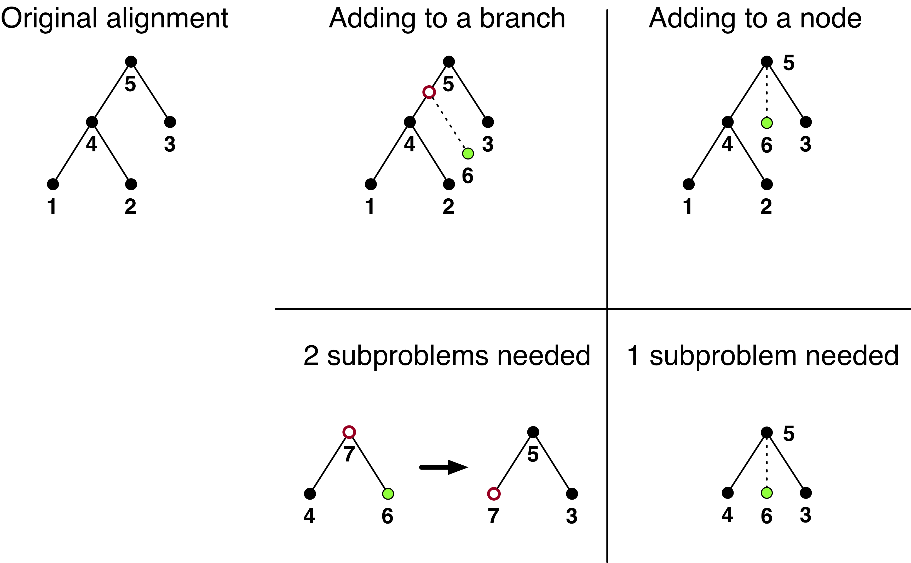

# Updating Cactus alignments
Because of the hierarchical structure of the alignments Cactus produces, you can add, remove, or update genomes to an existing alignment without recomputing the entire alignment from scratch. This document briefly outlines the steps required. Ensure you have the [HAL toolkit](https://github.com/ComparativeGenomicsToolkit/cactus) installed; it comes with alignment-modification tools which we'll be using.

**Important: back up your alignment file before attempting any of these operations. If something goes wrong, the file may be completely unrecoverable.**
## Deleting a genome
Deleting a genome is easy. Just run:
```sh
halRemoveGenome <hal file> <genome to delete>
```

The parent ancestral genome of the genome you deleted will still hang around, since it's needed to establish the alignment relationships between the other genomes in the parent's subtree and its supertree. Only leaf genomes can be deleted, though reconstructed genomes may be deleted if all their children have already been deleted (since in that case they would now be a leaf genome).

The HAL file will remain the same size, since the genome data offsets cannot easily be shifted. If you need a smaller HAL file, check out the documentation for the `h5repack` command, or use the `halExtract` tool from the HAL toolkit (which is a bit slower than `h5repack`.
## Adding a new genome
Adding a new genome can be fairly complicated. The first thing to do is to determine *how* the genome should be added into the species tree: by splitting an existing branch (**add-to-branch**) or by adding the new genome as a child of an existing ancestral genome (**add-to-node**). These two ways allow you to maintain whatever species tree shape you want. Adding a genome to a node is slightly easier (it involves creating only one alignment rather than two), but may be more expensive since the alignment involves more genomes than in the add-to-branch case. Check out this handy diagram, showing the different ways that a genome "6" can be added:



### Adding to a branch
Splitting a branch involves creating two alignments. This involves creating two separate Cactus alignments, one after the other. You'll have to start with the bottom half, since you're inferring a new ancestor. Here's what that might look like, where `genome6`, `genome7` etc. reflect 6, 7, etc. from the diagram (your names and FASTA locations should reflect the genomes in your tree):

"bottom_half.txt"
```
((genome6, genome4)genome7, genome3)genome5;

genome6 genome6.fa
genome4 genome4.fa
[...]
```

Then, run that alignment as normal, i.e. `cactus jobStore bottom_half.txt bottom_half.hal --root genome7 [--options]`. The `--root genome7` option is included here because we only want genome3 as outgroup information to help us infer genome7 more accurately.

After that's complete, you can work on the top half. First, you'll need to extract the FASTA file for the genome you just inferred:

```
hal2fasta bottom_half.hal genome7 > genome7.fa
```

Then create a file that looks something like (again, filling in whatever makes sense in your tree):

"top_half.txt"
```
(genome7, genome3)genome5;

genome7 genome7.fa
genome3 genome3.fa
genome5 genome5.fa
```

Use that to run Cactus again, creating `top_half.hal`.

Now you can modify your HAL file (ensuring you've backed it up):
```
halAddToBranch <your original alignment hal file> bottom_half.hal top_half.hal genome5 genome7 genome4 genome6 <length of genome5-genome7 branch> <length of genome7-genome6 branch>
```
which isn't exactly obvious. The meaning behind specifying these genomes is to orient the process, showing which genomes actually need to be updated or inserted in which places.

The branch lengths don't impact the alignment at this stage, they only impact the Newick tree that HAL displays.
### Adding to a node
Adding a genome as a new child of an existing ancestor requires creating only a single alignment (though that alignment will be more computationally expensive than usual, since it will involve more genomes than in the add-to-branch case). Again following our example, the sequence file should look something like this, with names and paths modified to suit your specific situation:

"add_to_node.txt"
```
(genome4, genome6, genome3)genome5;

genome6 genome6.fa
genome5 genome5.fa
[...]
```

Run this alignment as you would normally to create "add_to_node.hal". Then you can run:
```
halReplaceGenome alignment_to_add_to.hal --bottomAlignmentFile add_to_node.hal --topAlignmentFile alignment_to_add_to.hal genome5
```

After that, `alignment_to_add_to.hal` should contain the new genome.
## Replacing a genome
A genome can be replaced (for example to update an assembly version) by removing it and then following the "add-to-node" procedure to add the new version back as a child of its parent.
## Validating the file
It's a good idea to run a validation against the resulting file to make sure the operation went OK. Run:
```sh
halValidate --genome <genome you modified> <hal file>
```
If it doesn't raise an error, you should be good to go! If it does raise an error, please raise an issue on the [HAL github page](https://github.com/ComparativeGenomicsToolkit/hal).
